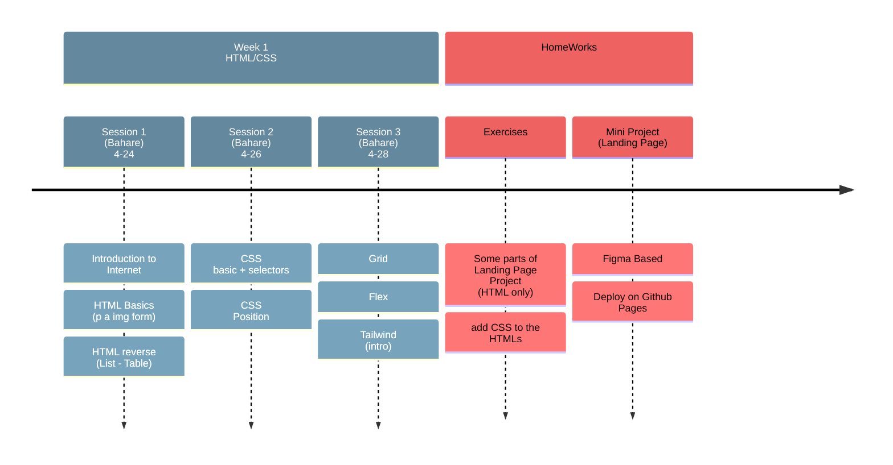
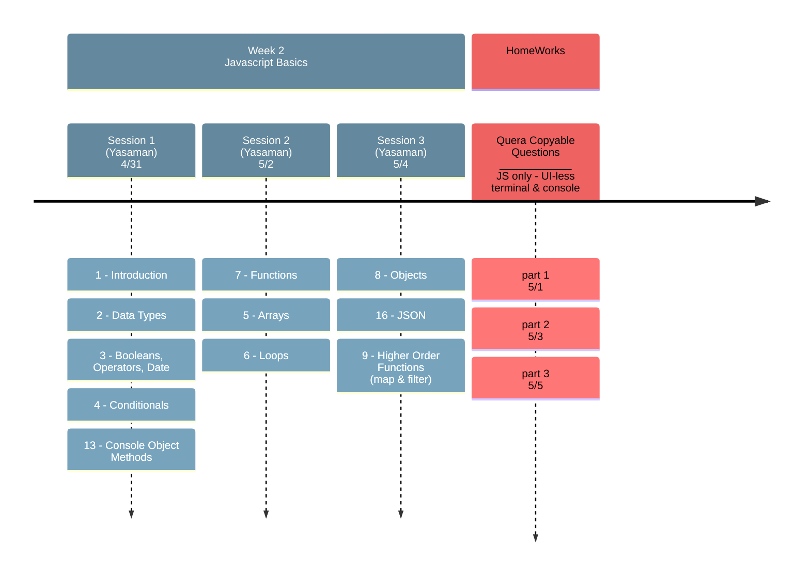
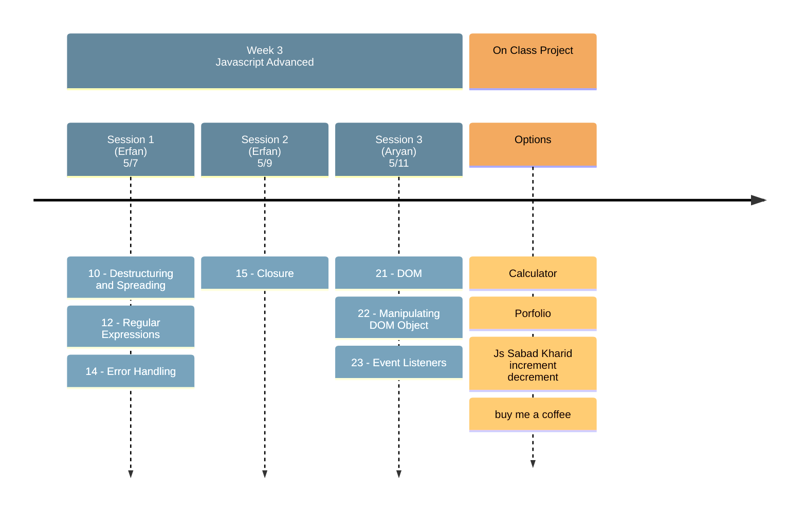
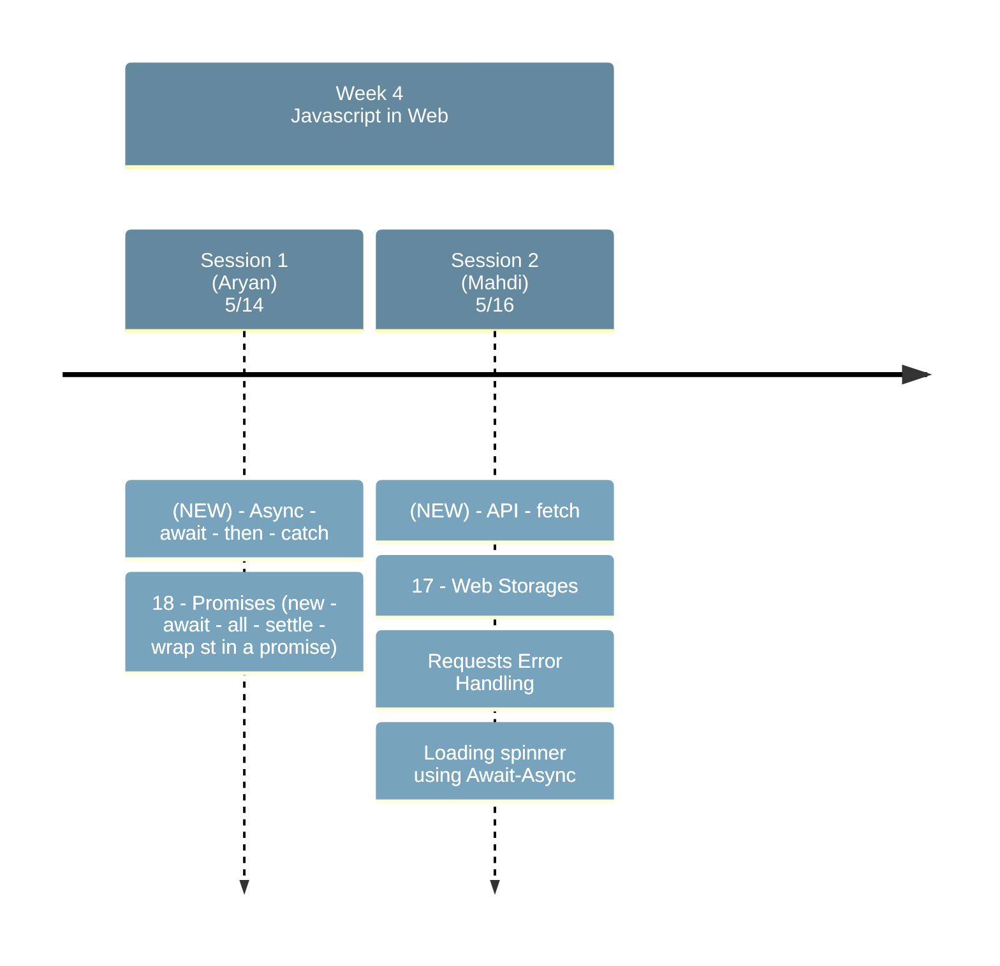
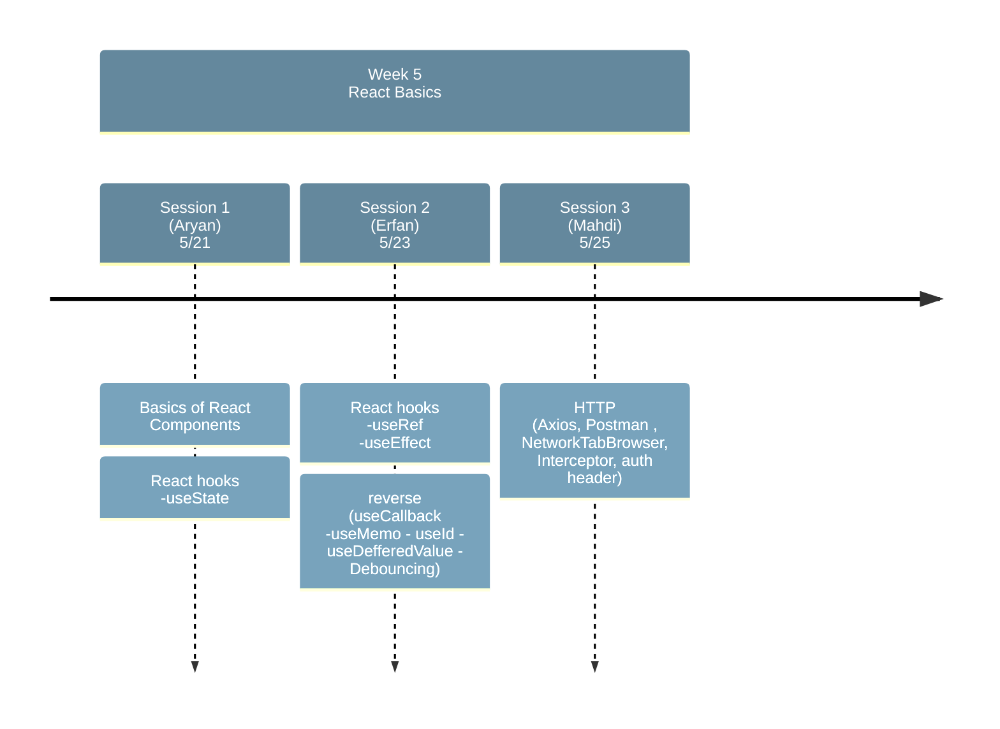
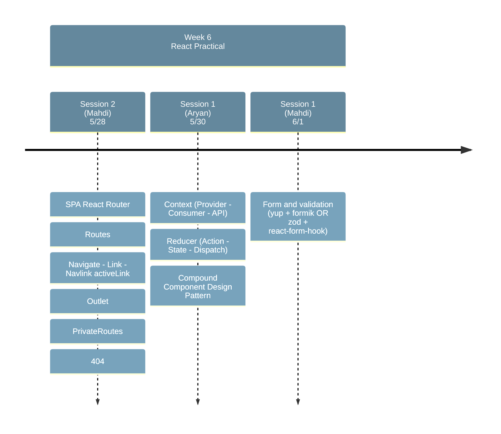
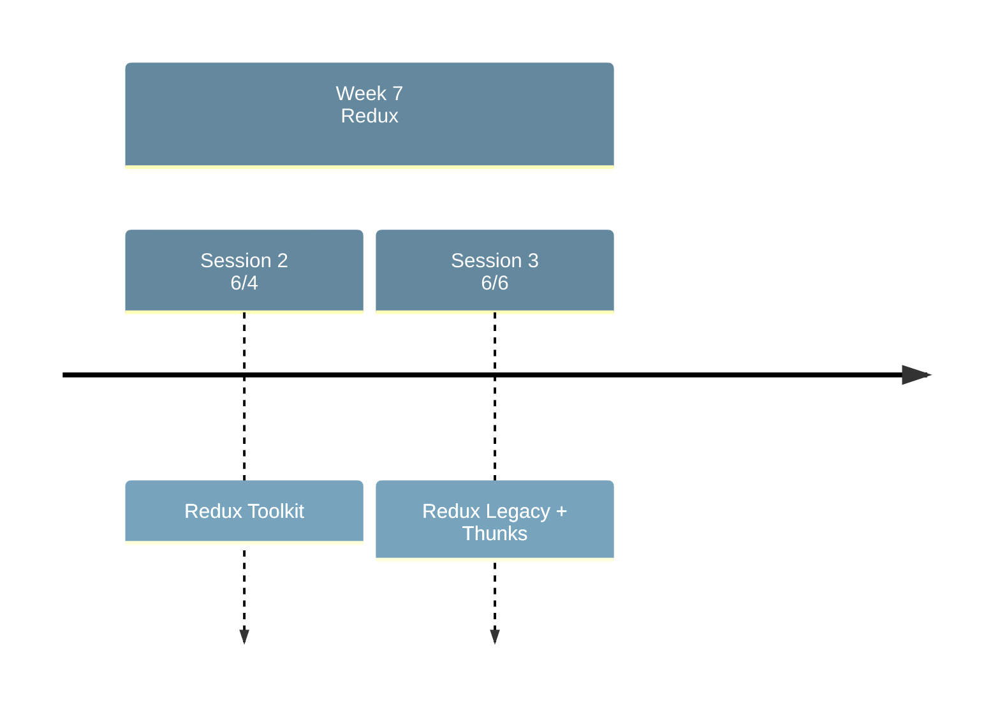

# FrontendBootcamp

```mermaid
%%{init: { 'logLevel': 'debug', 'theme': 'default' , 'themeVariables': {
              'cScale0': '#64889D',
              'cScale1': '#EF6262',
              'cScale2': '#42657E',
              'cScale3': '#1C3754',
              'cScale4': '#42657E',
              'cScale5': '#557C93',
              'cScale6': '#1C3754',
              'cScale7': '#64889D'
       }  } }%%
timeline
    section Week 1 <br> HTML/CSS
        Session 1 <br> (Bahare) <br> 4-24
            : Introduction to Internet 
            : HTML Basics<br> (p a img form)
            : HTML reverse <br> (List - Table)
        Session 2 <br> (Bahare) <br> 4-26
            : CSS <br> basic + selectors
            : CSS <br> Position

        Session 3 <br> (Bahare) <br> 4-28
            : Grid
            : Flex
            : Tailwind <br> (intro)
    section HomeWorks 
        Exercises
            : Some parts of Landing Page Project  <br>(HTML only)
            : add CSS to the HTMLs
        Mini Project <br>(Landing Page)
            : Figma Based
            : Deploy on Github Pages


```

```mermaid
%%{init: { 'logLevel': 'debug', 'theme': 'default' , 'themeVariables': {
              'cScale0': '#64889D',
              'cScale1': '#EF6262',
              'cScale2': '#42657E',
              'cScale3': '#1C3754',
              'cScale4': '#42657E',
              'cScale5': '#557C93',
              'cScale6': '#1C3754',
              'cScale7': '#64889D'
       }  } }%%
timeline
    section Week 2 <br> Javascript Basics
        Session 1 <br>(Yasaman) <br> 4/31
            : 1 - Introduction
            : 2 - Data Types
            : 3 - Booleans, Operators, Date
            : 4 - Conditionals
            : 13 - Console Object Methods
        Session 2 <br>(Yasaman) <br> 5/2
            : 7 - Functions
            : 5	- Arrays
            : 6	- Loops
        Session 3 <br>(Yasaman) <br> 5/4
            : 8 - Objects
            : 16 - JSON
            : 9 - Higher Order Functions <br> (map & filter)
    section HomeWorks 
        Quera Copyable Questions <br> ____________ <br> JS only - UI-less<br> terminal & console
            : part 1 <br> 5/1
            : part 2 <br> 5/3
            : part 3 <br> 5/5

    
```

```mermaid
%%{init: { 'logLevel': 'debug', 'theme': 'default' , 'themeVariables': {
              'cScale0': '#64889D',
              'cScale1': '#F3AA60',
              'cScale2': '#42657E',
              'cScale3': '#1C3754',
              'cScale4': '#42657E',
              'cScale5': '#557C93',
              'cScale6': '#1C3754',
              'cScale7': '#64889D'
       }  } }%%
timeline
section Week 3 <br> Javascript Advanced 
        Session 1 <br> (Erfan) <br> 5/7

            : 10 - Destructuring and Spreading
            : 12 - Regular Expressions
            : 14 - Error Handling
        Session 2 <br> (Erfan) <br> 5/9
            : 15 - Closure
        Session 3 <br> (Aryan) <br> 5/11
            : 21 - DOM
            : 22 - Manipulating DOM Object
            : 23 - Event Listeners

section On Class Project
        Options
            : Calculator
            : Porfolio
            : Js Sabad Kharid increment decrement
            : buy me a coffee


```

```mermaid
%%{init: { 'logLevel': 'debug', 'theme': 'default' , 'themeVariables': {
              'cScale0': '#64889D',
              'cScale1': '#557C93',
              'cScale2': '#42657E',
              'cScale3': '#1C3754',
              'cScale4': '#42657E',
              'cScale5': '#557C93',
              'cScale6': '#1C3754',
              'cScale7': '#64889D'
       }  } }%%
timeline
    section Week 4 <br> Javascript in Web
        Session 1 <br> (Aryan) <br> 5/14
            : (NEW) - Async - await - then - catch
            : 18 - Promises (new - await - all - settle - wrap st in a promise)
        Session 2 <br> (Mahdi) <br> 5/16
            : (NEW) - API - fetch
            : 17 - Web Storages
            : Requests Error Handling
            : Loading spinner using Await-Async
            


```

```mermaid
%%{init: { 'logLevel': 'debug', 'theme': 'default' , 'themeVariables': {
              'cScale0': '#64889D',
              'cScale1': '#557C93',
              'cScale2': '#42657E',
              'cScale3': '#1C3754',
              'cScale4': '#42657E',
              'cScale5': '#557C93',
              'cScale6': '#1C3754',
              'cScale7': '#64889D'
       }  } }%%
timeline
    section Week 5 <br> React Basics
        Session 1  <br> (Aryan) <br> 5/21
            : Basics of React Components
            : React hooks  <br> -useState

        Session 2 <br> (Erfan) <br> 5/23
            : React hooks <br> -useRef <br> -useEffect
            : reverse <br> (useCallback -useMemo - useId - useDefferedValue - Debouncing)
        Session 3 <br> (Mahdi) <br> 5/25
            : HTTP <br> (Axios, Postman , NetworkTabBrowser, Interceptor, auth  header)

```

```mermaid
%%{init: { 'logLevel': 'debug', 'theme': 'default' , 'themeVariables': {
              'cScale0': '#64889D',
              'cScale1': '#557C93',
              'cScale2': '#42657E',
              'cScale3': '#1C3754',
              'cScale4': '#42657E',
              'cScale5': '#557C93',
              'cScale6': '#1C3754',
              'cScale7': '#64889D'
       }  } }%%
timeline
    section Week 6 <br> React Practical

        Session 2 <br> (Mahdi) <br> 5/28
            : SPA React Router
            : Routes
            : Navigate - Link - Navlink activeLink
            : Outlet
            : PrivateRoutes
            : 404
        Session 1 <br> (Aryan) <br> 5/30
            : Context (Provider - Consumer - API)
            : Reducer (Action - State - Dispatch)    
            : Compound Component Design Pattern   
        Session 1 <br> (Mahdi) <br> 6/1
            : Form and validation <br> (yup + formik OR zod + react-form-hook)


```

```mermaid
%%{init: { 'logLevel': 'debug', 'theme': 'default' , 'themeVariables': {
              'cScale0': '#64889D',
              'cScale1': '#557C93',
              'cScale2': '#42657E',
              'cScale3': '#1C3754',
              'cScale4': '#42657E',
              'cScale5': '#557C93',
              'cScale6': '#1C3754',
              'cScale7': '#64889D'
       }  } }%%
timeline
    section Week 7 <br> Redux     
        Session 2 <br> 6/4
            : Redux Toolkit
        Session 3 <br> 6/6
            : Redux Legacy + Thunks
                


```
---
