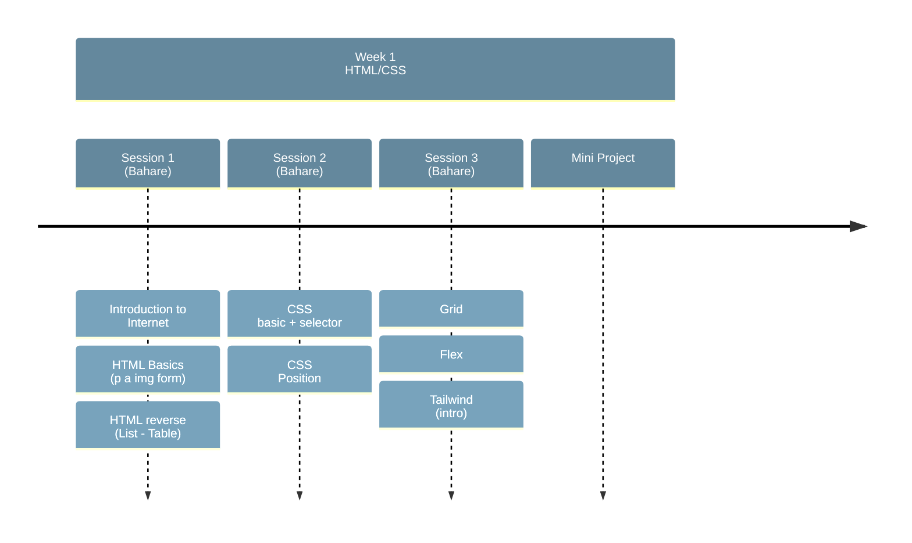
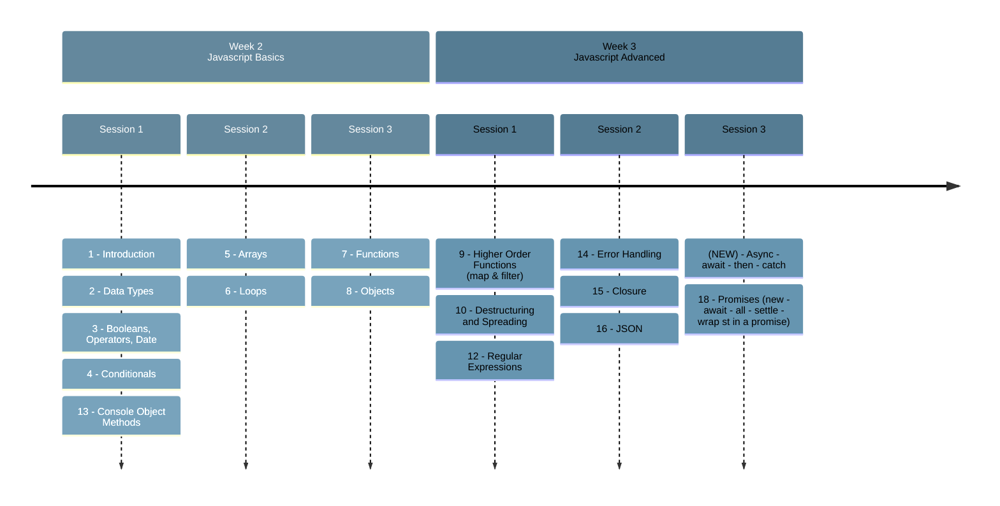
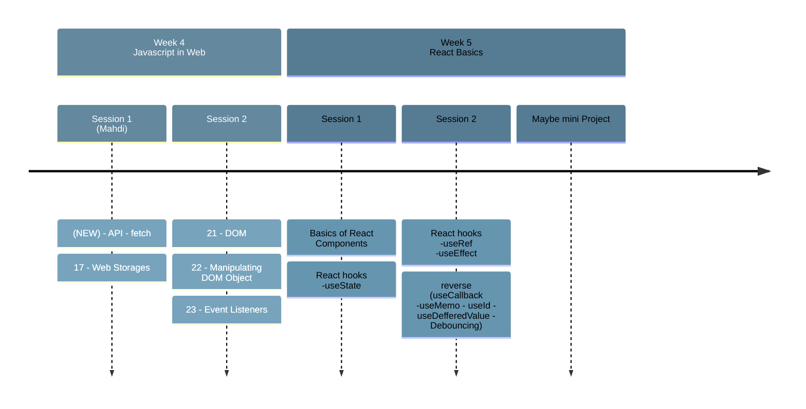
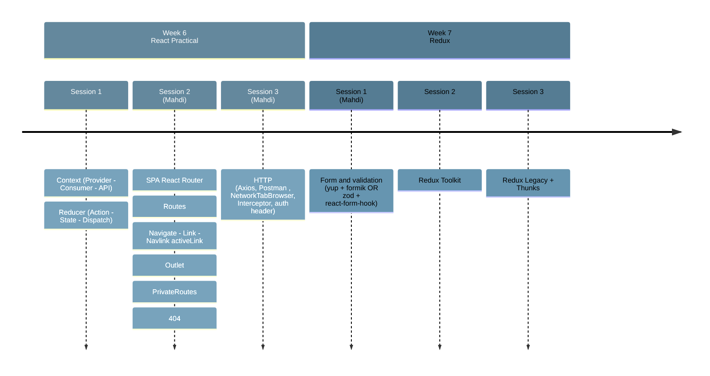

# FrontendBootcamp

```mermaid
%%{init: { 'logLevel': 'debug', 'theme': 'default' , 'themeVariables': {
              'cScale0': '#64889D',
              'cScale1': '#557C93',
              'cScale2': '#42657E',
              'cScale3': '#1C3754',
              'cScale4': '#42657E',
              'cScale5': '#557C93',
              'cScale6': '#1C3754',
              'cScale7': '#64889D'
       }  } }%%
timeline
    section Week 1 <br> HTML/CSS
        Session 1 <br> (Bahare)
            : Introduction to Internet 
            : HTML Basics<br> (p a img form)
            : HTML reverse <br> (List - Table)
        Session 2 <br> (Bahare)
            : CSS <br> basic + selector
            : CSS <br> Position

        Session 3 <br> (Bahare)
            : Grid
            : Flex
            : Tailwind <br> (intro)
            
        Mini Project
```

```mermaid
%%{init: { 'logLevel': 'debug', 'theme': 'default' , 'themeVariables': {
              'cScale0': '#64889D',
              'cScale1': '#557C93',
              'cScale2': '#42657E',
              'cScale3': '#1C3754',
              'cScale4': '#42657E',
              'cScale5': '#557C93',
              'cScale6': '#1C3754',
              'cScale7': '#64889D'
       }  } }%%
timeline
    section Week 2 <br> Javascript Basics
        Session 1 
            : 1 - Introduction
            : 2 - Data Types
            : 3 - Booleans, Operators, Date
            : 4 - Conditionals
            : 13 - Console Object Methods
        Session 2 
            : 5	- Arrays
            : 6	- Loops
        Session 3 
            : 7 - Functions
            : 8 - Objects
    section Week 3 <br> Javascript Advanced
        Session 1 
            : 9 - Higher Order Functions <br> (map & filter)
            : 10 - Destructuring and Spreading
            : 12 - Regular Expressions
        Session 2 
            : 14 - Error Handling
            : 15 - Closure
            : 16 - JSON
        Session 3 
            : (NEW) - Async - await - then - catch
            : 18 - Promises (new - await - all - settle - wrap st in a promise)
```

```mermaid
%%{init: { 'logLevel': 'debug', 'theme': 'default' , 'themeVariables': {
              'cScale0': '#64889D',
              'cScale1': '#557C93',
              'cScale2': '#42657E',
              'cScale3': '#1C3754',
              'cScale4': '#42657E',
              'cScale5': '#557C93',
              'cScale6': '#1C3754',
              'cScale7': '#64889D'
       }  } }%%
timeline
    section Week 4 <br> Javascript in Web
        Session 1 <br> (Mahdi)
            : (NEW) - API - fetch
            : 17 - Web Storages
        Session 2 
            : 21 - DOM
            : 22 - Manipulating DOM Object
            : 23 - Event Listeners
    section Week 5 <br> React Basics
        Session 1 
            : Basics of React Components
            : React hooks  <br> -useState

        Session 2 
            : React hooks <br> -useRef <br> -useEffect
            : reverse <br> (useCallback -useMemo - useId - useDefferedValue - Debouncing)
        Maybe mini Project 
```

```mermaid
%%{init: { 'logLevel': 'debug', 'theme': 'default' , 'themeVariables': {
              'cScale0': '#64889D',
              'cScale1': '#557C93',
              'cScale2': '#42657E',
              'cScale3': '#1C3754',
              'cScale4': '#42657E',
              'cScale5': '#557C93',
              'cScale6': '#1C3754',
              'cScale7': '#64889D'
       }  } }%%
timeline
    section Week 6 <br> React Practical
        Session 1 
            : Context (Provider - Consumer - API)
            : Reducer (Action - State - Dispatch)
        Session 2 <br> (Mahdi)
            : SPA React Router
            : Routes
            : Navigate - Link - Navlink activeLink
            : Outlet
            : PrivateRoutes
            : 404
        Session 3 <br> (Mahdi)
            : HTTP <br> (Axios, Postman , NetworkTabBrowser, Interceptor, auth  header)

    section Week 7 <br> Redux            
        Session 1 <br> (Mahdi)
            : Form and validation <br> (yup + formik OR zod + react-form-hook)
        Session 2
            : Redux Toolkit
        Session 3
            : Redux Legacy + Thunks
                


```
---
#### Full Roadmap

```mermaid
%%{init: { 'logLevel': 'debug', 'theme': 'default' , 'themeVariables': {
              'cScale0': '#64889D',
              'cScale1': '#557C93',
              'cScale2': '#42657E',
              'cScale3': '#1C3754',
              'cScale4': '#42657E',
              'cScale5': '#557C93',
              'cScale6': '#1C3754',
              'cScale7': '#64889D'
       }  } }%%
timeline
    section Week 1 <br> HTML/CSS
        Session 1 
            : Introduction to Internet 
            : HTML Basics<br> (p a img form)
            : HTML reverse <br> (List - Table)
        Session 2 
            : CSS <br> basic + selector
            : CSS <br> Position

        Session 3 
            : Grid
            : Flex
            : Tailwind <br> (intro)
            
        Mini Project

    section Week 2 <br> Javascript Basics
        Session 1 
            : 1 - Introduction
            : 2 - Data Types
            : 3 - Booleans, Operators, Date
            : 4 - Conditionals
            : 13 - Console Object Methods
        Session 2 
            : 5	- Arrays
            : 6	- Loops
        Session 3 
            : 7 - Functions
            : 8 - Objects
    section Week 3 <br> Javascript Advanced
        Session 1 
            : 9 - Higher Order Functions <br> (map & filter)
            : 10 - Destructuring and Spreading
            : 12 - Regular Expressions
        Session 2 
            : 14 - Error Handling
            : 15 - Closure
            : 16 - JSON
        Session 3 
: (NEW) - Async - await - then - catch
: 18 - Promises (new - await - all - settle - wrap st in a promise)
    section Week 4 <br> Javascript in Web
        Session 1 
            : (NEW) - API - fetch
            : 17 - Web Storages
        Session 2 
            : 21 - DOM
            : 22 - Manipulating DOM Object
            : 23 - Event Listeners
    section Week 5 <br> React Basics
        Session 1 
            : Basics of React Components
            : React hooks  <br> -useState

        Session 2 
            : React hooks <br> -useRef <br> -useEffect
            : reverse <br> (useCallback -useMemo - useId - useDefferedValue - Debouncing)
        Maybe mini Project 
    section Week 6 <br> React Practical
        Session 1 
            : Context (Provider - Consumer - API)
            : Reducer (Action - State - Dispatch)
        Session 2 
            : SPA React Router
            : Routes
            : Navigate - Link - Navlink activeLink
            : Outlet
            : PrivateRoutes
            : 404
        Session 3 
            : HTTP <br> (Axios, Postman , NetworkTabBrowser, Interceptor, auth  header)
        Maybe Mini Project
    section Week 7 <br> Redux            
        Session 1 
            : Form and validation <br> (yup + formik OR zod + react-form-hook)
        Session 2
            : Redux Toolkit
        Session 3
            : Redux Legacy + Thunks
                

        Maybe mini Project 
```