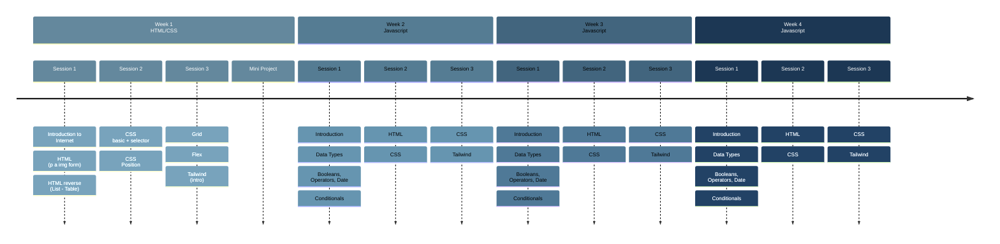
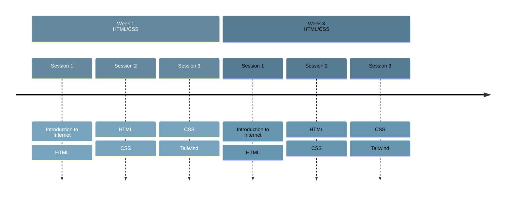

# FrontendBootcamp

```mermaid
%%{init: { 'logLevel': 'debug', 'theme': 'default' , 'themeVariables': {
              'cScale0': '#64889D',
              'cScale1': '#557C93',
              'cScale2': '#42657E',
              'cScale3': '#1C3754',
              'cScale4': '#42657E',
              'cScale5': '#557C93',
              'cScale6': '#1C3754',
              'cScale7': '#64889D'
       }  } }%%
timeline
    section Week 1 <br> HTML/CSS
        Session 1 
            : Introduction to Internet 
            : HTML <br> (p a img form)
            : HTML reverse <br> (List - Table)
        Session 2 
            : CSS <br> basic + selector
            : CSS <br> Position

        Session 3 
            : Grid
            : Flex
            : Tailwind <br> (intro)
            
        Mini Project

    section Week 2 <br> Javascript
        Session 1 
            : Introduction
            : Data Types
            : Booleans, Operators, Date
            : Conditionals
        Session 2 
            : HTML 
            : CSS
        Session 3 
            : CSS 
            : Tailwind
    section Week 3 <br> Javascript
        Session 1 
            : Introduction
            : Data Types
            : Booleans, Operators, Date
            : Conditionals
        Session 2 
            : HTML 
            : CSS
        Session 3 
            : CSS 
            : Tailwind
    section Week 4 <br> Javascript
        Session 1 
            : Introduction
            : Data Types
            : Booleans, Operators, Date
            : Conditionals
        Session 2 
            : HTML 
            : CSS
        Session 3 
            : CSS 
            : Tailwind


```
---

```mermaid
%%{init: { 'logLevel': 'debug', 'theme': 'default' , 'themeVariables': {
              'cScale0': '#64889D',
              'cScale1': '#557C93',
              'cScale2': '#42657E',
              'cScale3': '#1C3754',
              'cScale4': '#42657E',
              'cScale5': '#557C93',
              'cScale6': '#1C3754',
              'cScale7': '#64889D'
       }  } }%%
timeline
    section Week 1 <br> HTML/CSS
        Session 1 
            : Introduction to Internet 
            : HTML 
        Session 2 
            : HTML 
            : CSS
        Session 3 
            : CSS 
            : Tailwind

    section Week 3 <br> HTML/CSS
        Session 1 
            : Introduction to Internet 
            : HTML 
        Session 2 
            : HTML 
            : CSS
        Session 3 
            : CSS 
            : Tailwind


```
---

```mermaid
%%{init: { 'logLevel': 'debug', 'theme': 'default' , 'themeVariables': {
              'cScale0': '#64889D',
              'cScale1': '#557C93',
              'cScale2': '#42657E',
              'cScale3': '#1C3754',
              'cScale4': '#42657E',
              'cScale5': '#557C93',
              'cScale6': '#1C3754',
              'cScale7': '#64889D'
       }  } }%%
timeline
    section Week 1 <br> HTML/CSS
        Session 1 
            : Introduction to Internet 
            : HTML 
        Session 2 
            : HTML 
            : CSS
        Session 3 
            : CSS 
            : Tailwind

    section Week 3 <br> HTML/CSS
        Session 1 
            : Introduction to Internet 
            : HTML 
        Session 2 
            : HTML 
            : CSS
        Session 3 
            : CSS 
            : Tailwind


```
